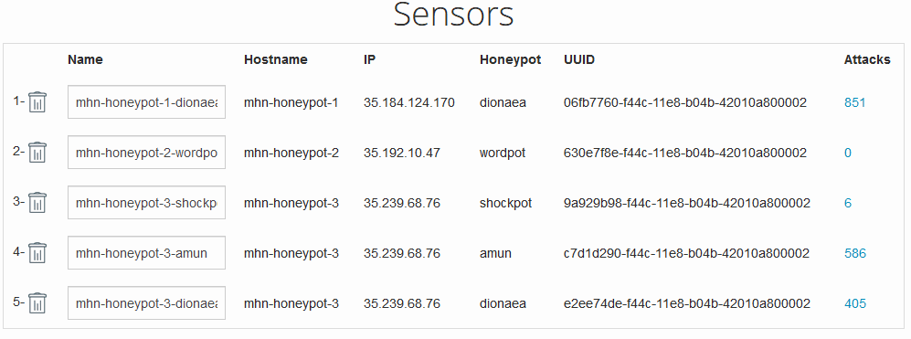
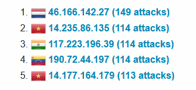
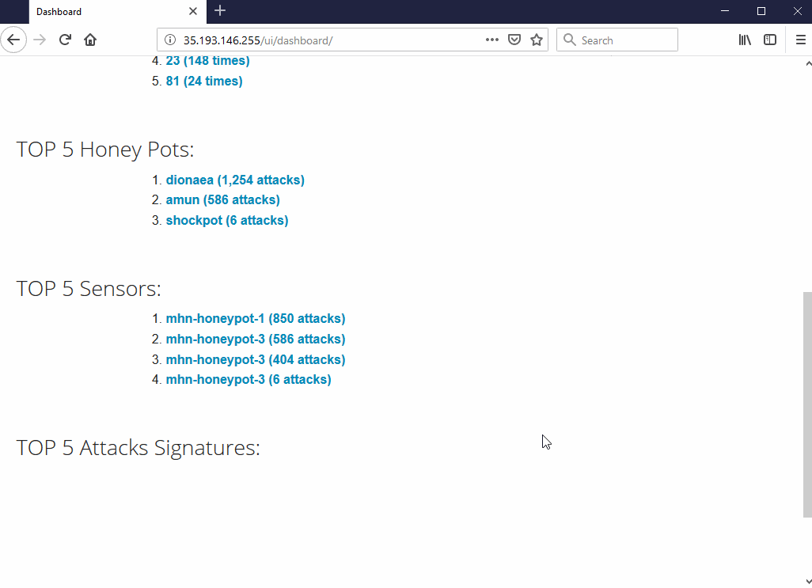

# Week 9 Project: Honeypot

## Which Honeypot(s) you deployed

## Any issues you encountered
I had trouble in installing the MHN Admin Application,the provided git clone link was not working,so I used the one that TPM provided instead. I also had problem after I set up the VMs, the external IP could not be accessed. After several trials of doing from the beginning, the problem remained still, so I had to use the other computer which works fine. 
## A summary of the data collected: 
Number of Attacks: 
	
	1846

Top 5 Attacker IPs:

Top 5 Attacked Ports:

| No. | Port | Attack times |
|:---:|:----:|:------------:|
| 1 | 445 | 558 |
| 2 | 8088 | 426 |
| 3 | 5060 | 159 |
| 4 | 23 | 148 |
| 5 | 81 | 24 |

Top 5 Honey spots:

	1.dionaea (1254 attacks)
	2.amun (586 attacks)
	3.shockpot (6 attacks)

## Any unresolved questions raised by the data collected
None.
